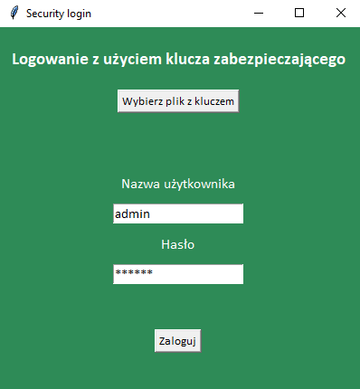

# hash_password_blake2 #  

**main.py**  
Przykladowy panel logowania z wykorzystaniem pliku z kluczem zabezpieczajacym.  
Haslo zostalo wczesniej zhashowane i zapisane w pliku pswd.txt. Plik może znajdowac sie na usb.
Uzytkownik wskazuje lokalizacje pliku z kluczem i nastepnie podaje swoj login i haslo, ktore zostaje zhashowane i porownane z kluczem.  
(przykladowe haslo: admin)  
   

- Python 3.6.8
- hashlib
- tkinter  

    
**koder1.py**  
Hashowanie hasła algorytmem Blake2 z biblioteki hashlib.
- Python 3.6.8
- hashlib
